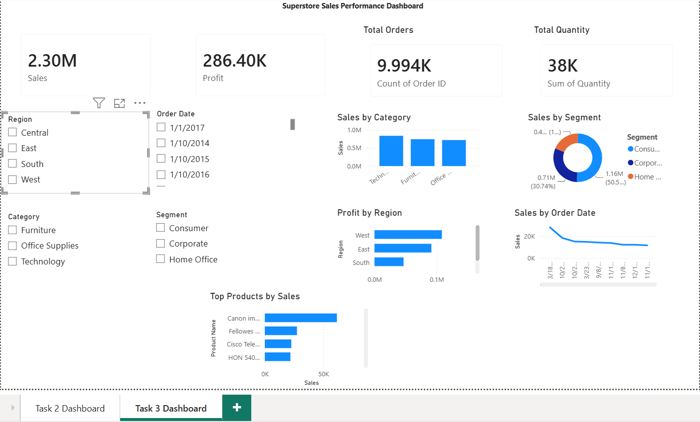

# Task 3 - Interactive Sales Dashboard (Power BI)

## 📌 Objective

Design an interactive dashboard for business stakeholders using Power BI to analyze sales performance, profit trends, and business insights.

## 📊 Dataset

**Sample Superstore Dataset**

### Columns Used

* Sales
* Profit
* Quantity
* Category
* Region
* Segment
* Order Date
* Product Name

## 🛠 Tools Used

* Power BI
* Microsoft PowerPoint
* GitHub

## 📈 KPI Cards

* Total Sales
* Total Profit
* Total Orders
* Total Quantity

## 📊 Dashboard Features

* Interactive Slicers (Region, Category, Segment, Order Date)
* Sales by Category Analysis
* Sales by Segment Analysis
* Profit by Region Analysis
* Sales Trend Over Time
* Top Products by Sales

## 📷 Dashboard Screenshot

## 🔍 Key Insights

* Technology category generated the highest sales.
* Consumer segment contributed the largest revenue share.
* West region achieved the highest profit.
* Sales trends varied across different time periods.
* Interactive filters improve business analysis and decision-making.

## 📂 Deliverables

* Power BI Dashboard (.pbix)
* PPT Summary (.pptx)
* Dashboard Screenshot
* README Documentation

## 🎯 Outcome

This project demonstrates the use of Power BI for creating interactive business dashboards, KPI tracking, sales analysis, profit analysis, and data-driven decision-making.
